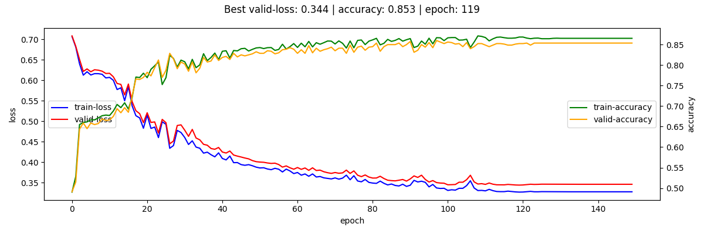
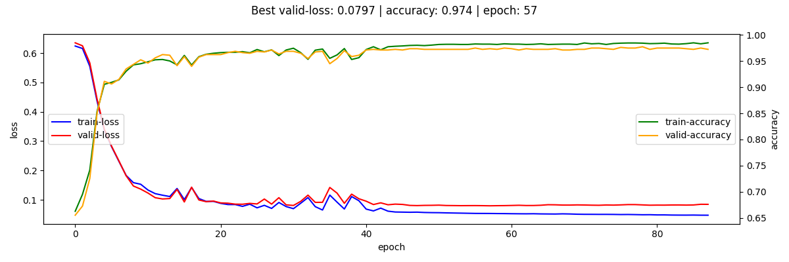
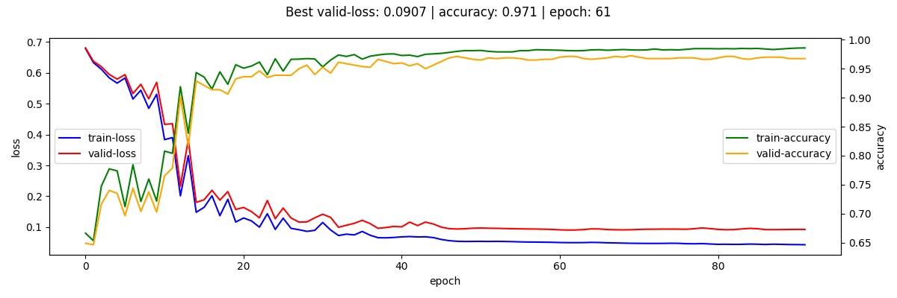
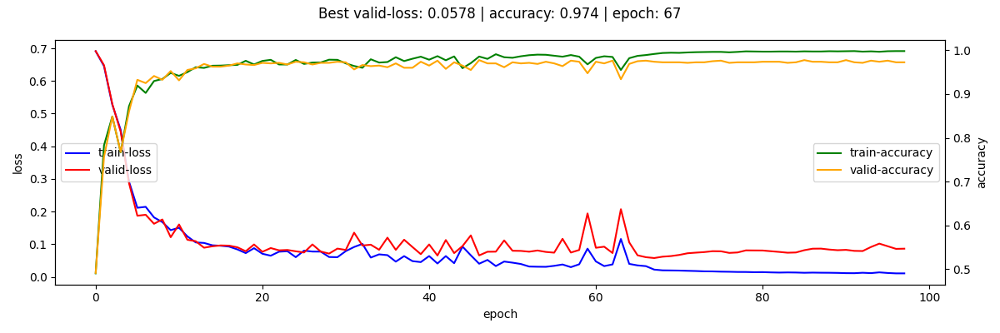
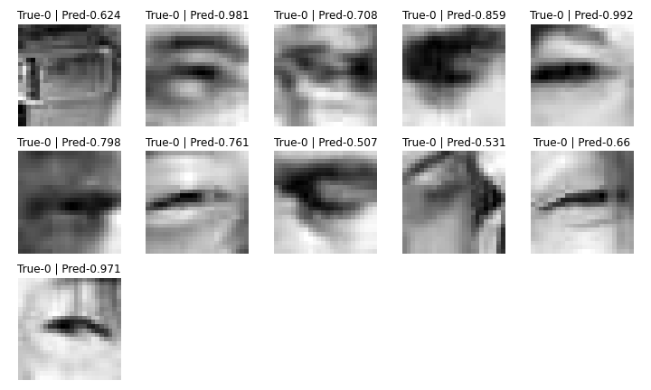
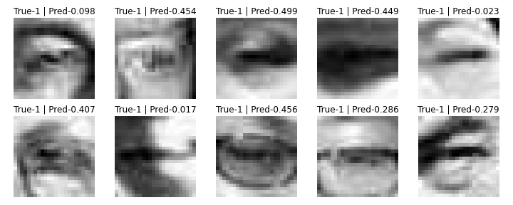
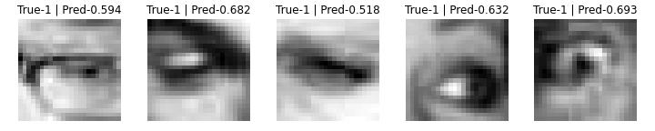
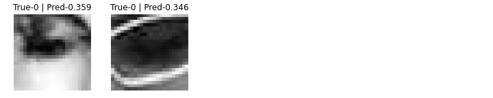
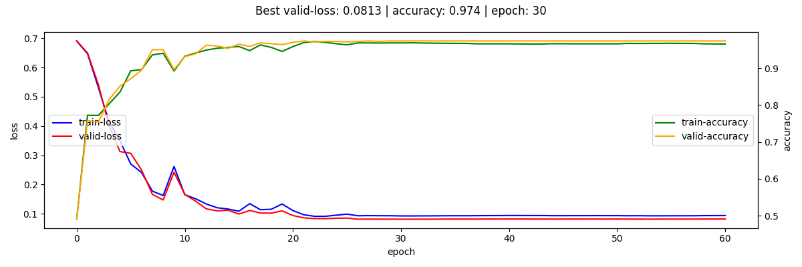
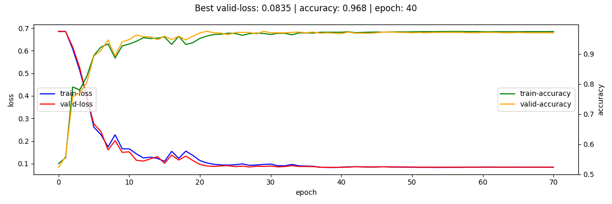

## Research Steps
### Step 1: Familiarizing  with the Data
Firstly, I looked at ~300 images to decide what to do next.
I noticed that both classes have strong patterns: e.g., most of closed eyes
images have horizontal line in the center of an image. It shouldn't be hard to classify.
Also, there is no class imbalance. 

**The main problem was the lack of annotation.**

### Step 2: Annotation
I supposed that I could:
* annotate manually ~500 images (and use ~400 for training and ~100 for validation);
* annotate additional data if needed.

Then I decided to google something about opened-closed eyes classification problem and found
[**Closed Eyes In The Wild (CEW) dataset**](http://parnec.nuaa.edu.cn/_upload/tpl/02/db/731/template731/pages/xtan/ClosedEyeDatabases.html).

Eye patches from CEW dataset (hereinafter "CEW dataset") looks very similar to the original data.
I thought that it might be not a similar one, but the same.

#### Datasets' Identity Check
* The data is very small, hence I can load both (original and CEW) datasets into RAM.
* Then I need to compare each image from one dataset with each image from another 
  until the identical image is found.
* To speed up this process, I decided to split images into groups by file size. 
  * For more details, please, consider: [`./utils/crossval_split.py`](./utils/crossval_split.py)

**CEW dataset and the original one are identical**,
except one thing: the original data lacks 850 images. Hence, **the annotation problem is solved**.

*BTW, 4 images in CEW dataset are broken => not 850, but 846 images.*

### Step 3: Train-Valid-Test Split
I suppose, that the hidden test datasets consists of 850 images, which exist in CEW dataset
and are missed in the origianl one. If it is true, I can overfit a model and reach 100% accuracy on the test set.

But what if the hidden set contains images, which do not exist in CEW dataset?
In this case my overfitted model will fail.

Not to fail with an overfitted model, I will use potentially-hidden images on training.
  
##### Test and Cross-validation Split
For training and validation I will use CWE dataset.
* **test**: 846 images which I will use only when the final model is ready.
  Here I will use images which *exist* in the original dataset.
* **train/valid**: 5-folds cross-validation on the images left after separation of the 'test' set.
  * 1st fold will contain all of the potentially-hidden images in the training set.
  
Train-Valid-Test split is performed here: [`./utils/crossval_split.py`](./utils/crossval_split.py)

### Step 4: Model Selection
I see 2 paths to initialize a model:
1) compile a custom one by myself;
2) take a ready architecture (maybe, pretrained one).

The 2nd approach may be not very suitable, because:
* SOTA architectures maybe too complicated for generalizing well on such simple data;
* pretrained models are pretrained on data from different distributions.

I will try to compile and fit an own architecture.

### Step 5: Fitting the Model
Before fitting the model I estimated dataset's mean and std for normalization
(code is here: [`./utils/image_normalization.py`](./utils/image_normalization.py)).

Details re versions of:
* models: [`./train/versions/model.py`](./train/versions/model.py)
* loss-functions: [`./train/versions/criterions.py`](./train/versions/criterion.py)
* augmentation: [`./train/versions/augmentation.py`](./train/versions/augmentation.py)
* optimizers: [`./train/versions/optimizer.py`](./train/versions/optimizer.py)
* schedulers: [`./train/versions/scheduler.py`](./train/versions/scheduler.py)

*Loss and accuracy charts below are for the fold-1.*

Full versions' config-files are: `./output/models/v-*/fold-*/config.json`

#### Hypothesis 1
In this hypothesis I compile a basic CNN, which consists of
* **`Model version: 1`** (`CustomNetV1`: 2xConv + 3xFC layers)
* **`Optimizer version: adam_1`** (lr: 3.20E-02)
  * lr found via torch_lr_finder: [`./notebooks/lr_finder/v1.ipynb`](./notebooks/lr_finder/v1.ipynb)
* **`Augmentation version: 1`** (Normalization + Horizontal flip + Brightness + Contrast + Blur)
* **`Criterion version: 1`** (Binary Cross Entropy)
* **`Scheduler version: rop_1`** (reduce-on-plateau after 5 epochs)

During several last epochs both of the losses have not beem updating:
it looks like the gradients blowed up.

#### Hypothesis 2
To overcome exploding gradients I will add BatchNorm layer before the second Conv layer.

* **`Model version: 2`**
* **`Optimizer version: adam_2`** (lr: 4.53E-03)
  * lr found via torch_lr_finder: [`./notebooks/lr_finder/v2.ipynb`](./notebooks/lr_finder/v2.ipynb)
* **`Augmentation version: 1`**
* **`Criterion version: 1`**
* **`Scheduler version: rop_1`**

#### Hypothesis 3
BatchNorm helped. Model doesn't reach 100% accuracy on the training set =>
I will add 1 Conv and 1 FC layers.

*BTW, I am increasing the model size in 3 directions: deppth, width, resolution
(EfficientNet paper showed, that all of 3 directions should be modified all together).*

* **`Model version: 3`**
* **`Optimizer version: adam_3`** (lr: 3.43E-03)
  * lr found via torch_lr_finder: [`./notebooks/lr_finder/v3.ipynb`](./notebooks/lr_finder/v3.ipynb)
* **`Augmentation version: 1`**
* **`Criterion version: 1`**
* **`Scheduler version: rop_1`**

#### Hypothesis 4
Adding additional Conv and FC layers helped (in Version 3). Let's add some more.

* **`Model version: 4`**
* **`Optimizer version: adam_4`** (lr: 1.96E-03)
  * lr found via torch_lr_finder: [`./notebooks/lr_finder/v4.ipynb`](./notebooks/lr_finder/v4.ipynb)
* **`Augmentation version: 1`**
* **`Criterion version: 1`**
* **`Scheduler version: rop_1`**

At this step I decided to look at the model inference in more details.
Takeaways:
* there are some mistakes in data annotation;
* some images can be hardly classified by human (me).

  
<b>Images (Valid Dataset)</b>

##### False Positive

##### False Negative

##### True Positive with Low Confidence (<0.7)

##### True Negative with Low Confidence (>0.3)

#### Hypothesis 5
In Version 4 the model overfitted (last epoch losses: train-0.021; valid-0.101) .
I will try to overcome overfitting by improving augmentation.

Also, I noticed that the valid-loss starts to decrease after reduce-lr-on-plateu,
<u>even if it was rising for several epochs before</u>.
Hence, I will reduce `patience` parameter in the LR-scheduler.

* **`Model version: 4`**
* **`Optimizer version: adam_4`**
* **`Augmentation version: 2`**
* **`Criterion version: 1`**
* **`Scheduler version: rop_2`**

#### Hypothesis 6
Additional augmentation helped to decrease loss In Version 5.
In this version I will try to add dropout layers to FC layers.

* **`Model version: 5`**
* **`Optimizer version: adam_5`** (lr: 2.36E-03)
  * lr found via torch_lr_finder: [`./notebooks/lr_finder/v5.ipynb`](./notebooks/lr_finder/v5.ipynb)
* **`Augmentation version: 2`**
* **`Criterion version: 1`**
* **`Scheduler version: rop_2`**

#### Hypothesis 7
Dropout layers in Version 6 helped to overcome overfitting slightly, but accuracy dropped and loss increased.
In this version I will try to increase model's width.

* **`Model version: 6`**
* **`Optimizer version: adam_6`** (lr: 2.15E-03)
  * lr found via torch_lr_finder: [`./notebooks/lr_finder/v6.ipynb`](./notebooks/lr_finder/v6.ipynb)
* **`Augmentation version: 2`**
* **`Criterion version: 1`**
* **`Scheduler version: rop_2`**

# DRAFTS ---------------------------
I will try to use a ready-to-go architecture to save time on writing a model from scratch.
If it fails, I will write my custom model.

I considered [Papers with Code](https://paperswithcode.com/)
section ['Image Classification on ImageNet'](https://paperswithcode.com/sota/image-classification-on-imagenet)
to select one of the recent well-established architectures.

For my first experiments I selected ["EfficientNet-B0"](https://arxiv.org/abs/2003.08237).
This architecture is relatively small - 5.3m parameters and
precise in [`timm` package](https://rwightman.github.io/pytorch-image-models/) with weights.  

This approach will allow:
* to reach 100% accuracy in case the hidden dataset consists of missed 850 images,
  because [n_folds - 1] of models will be fitted on this data;
* to reach accuracy comparable with mean cross-validation accuracy in case hidden dataset consists of 
  another images, but from the same distribution as images I have;
* also, using an ensemble of models usually provides better results then a single model.
  Inasmuch I do not have any inference time limitations,
  out-of-fold predictions should be a better solution in any case.
  
; from CEW dataset, which do not exist in the origginal dataset on training;
* validate model on  several models which generalize well (w/o overfitting) on different folds;
* average out-of-fold predictions in `OpenEyesClassificator.predict` method.