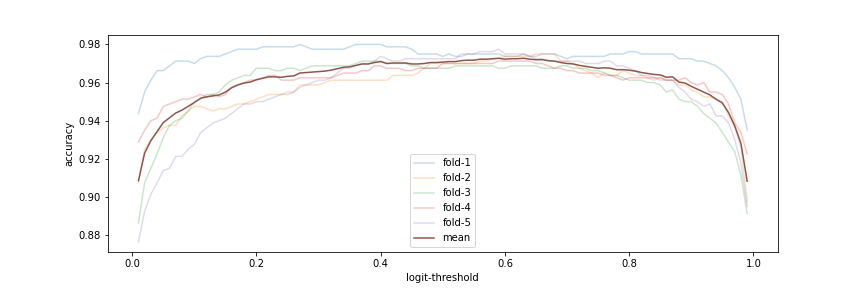
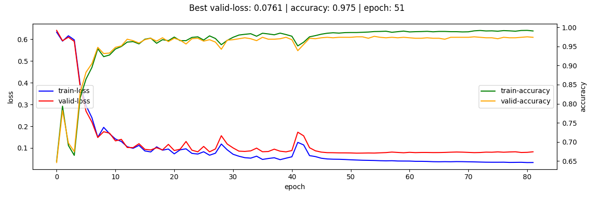

# Task Description
Build binary classifier for a dataset consisting of grayscale images of size 24x24 pixels.

* Positive class - opened eyes:
  * sample: 
* Negative class - closed eyes:
  * sample: 
  
**Note:** data is not annotated.

# Outputs

### OpenEyesClassificator Class
`OpenEyesClassificator` is here: [`./open_eyes_classificator/main.py`](./open_eyes_classificator/main.py)

You can check it via this notebook
*(it is independent of the Jupyter startup folder, but <u>keep the project structure as it is</u>)*:
[`./notebooks/open_eyes_classificator_demo.ipynb`](./notebooks/open_eyes_classificator_demo.ipynb)

`OpenEyesClassificator.__init__` methods contains 2 parameters:
* `model_type` (default: `ensemble`):
  * `ensemble`  - use ensemble of 5 models for prediction;
  * `single` - use a single model for prediction.
* `device` (default: `cpu`): to run on CPU or GPU.

#### Requirements
* [`requirements.txt`](requirements.txt) - contains the shortlist of required packages
  (other packages are in the dependencies of the listed ones);
* [`requirements_full.txt`](requirements_full.txt) - contains the full list of required packages
  (produced by `pip freeze` in the project's venv.
  
#### Report
The report is below.

# Report

## Classifier Performance
**My final classifier (ensemble of 5 models) demonstrated accuracy 0.9775  on the hidden dataset,
which corresponds to log-loss 0.0691.**

*My threshold for binary prediction is 0.59. I selected it on cross-validation:*
* wide-selection:
  * 
* narrow-selection
  * 
  
*Images are produced by this notebook:
[`./notebooks/inference_analysis/accuracy_threshold_selection.ipynb`](./notebooks/inference_analysis/accuracy_threshold_selection.ipynb).*
  
Worth to mention, that a lot of false classifications (especially FN)
are dedicated to images, with not clear pictures
*(which is unclear even for a human - I mean myself)*.   

### False Positive:

### False Negative

### True Positive with Low Confidence (<0.7)
*Confidence for all TP predictions is above 0.7.*

### True Negative with Low Confidence (>0.3)

*Images are produced by this notebook:
[`./notebooks/inference_analysis/final_model_performance.ipynb`](./notebooks/inference_analysis/final_model_performance.ipynb).*

## Data Annotation
My first thought was to annotate ~500 images manually and annotate additional data if needed.
Then I decided to google something about the opened-closed eyes classification problem and found the
[**Closed Eyes In The Wild (CEW) dataset**](http://parnec.nuaa.edu.cn/_upload/tpl/02/db/731/template731/pages/xtan/ClosedEyeDatabases.html).

Eye patches from the CEW dataset looked very similar to the original data.
I thought that it might be not the similar one, but the same.

I checked and found that the datasets are identical, except for 1 thing:
the original dataset lacks 850 images.

*P.S. `cv2.imread` returns `None` for 4 of the mentioned 850 images from the CEW dataset.*

*For more details re datasets' identity check, please, consider:
[`./utils/crossval_split.py`](./utils/crossval_split.py)*.

**The annotation "problem" was solved.**

## Test-Train-Valid- Split
For model training and validation I used the CWE dataset. I split the data in the following way: 
* **test / hidden**: 846 images from the CEW dataset, which do not exist in the original data.
  I used these images only when the final model was ready;
* **train / valid**: 5-folds cross-validation -> 3200 images for training and 800 images for validation

Test-Train-Valid split script: [`./utils/crossval_split.py`](./utils/crossval_split.py)

## Model Selection
Usually, I start my research from pretrained SOTA models, but:
* SOTA architectures are too complicated and, most likely, will overfit on such simple data;
* current SOTA architectures are pretrained on data from a different distribution.

Hence, I decided to compile and fit my custom model.
My research process is described below in section ["Research Process"](#research-process) 

*BTW, if you'd like to see how I utilize transfer learning, please, consider
[this repository](https://github.com/adrofa/cats-dogs-detection).*

## Repository Structure
### [`./data`](./data)
* [`/dataset_B_Eye_Images`](./data/dataset_B_Eye_Images) -
  [CEW dataset](http://parnec.nuaa.edu.cn/_upload/tpl/02/db/731/template731/pages/xtan/ClosedEyeDatabases.html);
  

* [`/EyesDataset`](./data/EyesDataset) - original dataset.

### [`./notebooks`](./notebooks)
* [`/inference_analysis`](./notebooks/inference_analysis) -
different notebooks for results analysis and their outputs (*.png files);
  

* [`/lr_finder`](./notebooks/lr_finder) - notebooks for learning rate selection via
  [`torch-lr-finder` package](https://github.com/davidtvs/pytorch-lr-finder) 
  * `/v1.ipynb` - `/v7.ipynb` - correspond to Hypothesis in the ["Research Process"](#research-process) section.
  
### [`./open_eyes_classificator`](./open_eyes_classificator)
* [`main.py`](./open_eyes_classificator/main.py) contains `OpenEyesClassificator` class.

### [`./output`](./output)

* [`/crossval_split`](./output/crossval_split):
  * [`/identity_df.pkl`](./output/crossval_split/identity_df.pkl) -
    pickle-dump of a `pandas.DataFrame` with columns:
      * `cew_img` - path to an image from [CEW dataset](./data/dataset_B_Eye_Images);
      * `original_img` - path to an image from [the original dataset](./data/EyesDataset);
      * `label` - image class: 1 - opened, 0 - closed; 
  * [`/crossval_dct.pkl`](./output/crossval_split/crossval_dct.pkl)
    pickle-dump with a dict with keys:
      * `hidden` - part of the `identity_df` with `test / hidden` images;
      * `1` - `5` - folds with train and valid parts of the `identity_df`;
  

* [`/image_normalization`](./output/image_normalization):
  * [`/normalization_params.txt`](./output/image_normalization/normalization_params.txt) -
    mean and std of CEW dataset;

    
* [`/models`](./output/models):
  * `/hypothesis-1` - `/hypothesis-7` - outputs (including models' weights) of Hypothesis
    described in ["Reseacrh Process"](#research-process) section;
    * `/fold-1` - `/fold-5` - folds of a corresponding hypothesis
      *(all 5 folds exist only for Hypothesis 4, other Hypothesis has only 1st fold)*.
      
### [`./train`](./train)
* [`/versions`](./train/versions) - versions of the training pipeline parts:
  * [`/augmentation.py`](./train/versions/augmentation.py) - augmentation's versions;
  * [`/criterion.py`](./train/versions/criterion.py) - loss-function's versions;
  * [`/model.py`](./train/versions/model.py) - model's versions (including models' classes);
  * [`/optimizer.py`](./train/versions/optimizer.py) - optimizer's versions;
  * [`/scheduler.py`](./train/versions/scheduler.py) - scheduler's versions.
  
* [`/run`](./train/run.py) - pipeline for a model fitting. 

### [`./utils`](./utils)
* [`/crossval_split.py`](./utils/crossval_split.py) - script, which
  (1) checks identity of the original and CEW datasets; (2) performs cross-validation split;
  
* [`/utils/image_normalization.py`](./utils/image_normalization.py) - script for collecting
  CEW dataset's stats (mean and std) for image_normalization;
  
* [`/support.py`](./utils/support.py) - contains different support functions.

## Research Process
Before fitting the model I estimated the dataset's mean and std for normalization
(code is here: [`./utils/image_normalization.py`](./utils/image_normalization.py)).

*Loss and accuracy charts below are for the fold-1.*

### Hypothesis 1
In this hypothesis I compile a basic CNN, which consists of 2xConv + 3xFC layers.

Config-file:
[`./output/models/hypothesis-1/fold-1/config.json`](./output/models/hypothesis-1/fold-1/config.json)

* **`Model version: 1`**
* **`Optimizer version: adam_1`** (lr: 3.20E-02)
  * lr found via torch_lr_finder: [`./notebooks/lr_finder/v1.ipynb`](./notebooks/lr_finder/v1.ipynb)
* **`Augmentation version: 1`** (Normalization + Horizontal flip + Brightness + Contrast + Blur)
* **`Scheduler version: rop_1`** (reduce-on-plateau after 5 epochs)
* **`Criterion version: 1`** (Binary Cross Entropy)

#### Results
During several last epochs, both of the losses have not been updating:
it looks like gradients exploding.

### Hypothesis 2
To overcome gradients exploding I will add BatchNorm layer before the second Conv layer.

Config-file:
[`./output/models/hypothesis-2/fold-1/config.json`](./output/models/hypothesis-2/fold-1/config.json)

* **`Model version: 2`**
* **`Optimizer version: adam_2`** (lr: 4.53E-03)
  * lr found via torch_lr_finder: [`./notebooks/lr_finder/v2.ipynb`](./notebooks/lr_finder/v2.ipynb)
* **`Augmentation version: 1`**
* **`Scheduler version: rop_1`**
* **`Criterion version: 1`**

#### Results
BatchNorm helped. The model didn't overfit.

### Hypothesis 3
I will add 1 Conv and 1 FC layers.

*BTW, I am increasing the model size in 3 directions: depth, width, resolution
(EfficientNet paper showed, that increasing 3 directions simultaneously is more reasonable).*

Config-file:
[`./output/models/hypothesis-3/fold-1/config.json`](./output/models/hypothesis-3/fold-1/config.json)

* **`Model version: 3`**
* **`Optimizer version: adam_3`** (lr: 3.43E-03)
  * lr found via torch_lr_finder: [`./notebooks/lr_finder/v3.ipynb`](./notebooks/lr_finder/v3.ipynb)
* **`Augmentation version: 1`**
* **`Scheduler version: rop_1`**
* **`Criterion version: 1`**

#### Results
Layers addition improved metrics.

### Hypothesis 4
Let's add some layers.

Config-file:
[`./output/models/hypothesis-4/fold-1/config.json`](./output/models/hypothesis-4/fold-1/config.json)

* **`Model version: 4`**
* **`Optimizer version: adam_4`** (lr: 1.79E-03)
  * lr found via torch_lr_finder: [`./notebooks/lr_finder/v4.ipynb`](./notebooks/lr_finder/v4.ipynb)
* **`Augmentation version: 1`**
* **`Scheduler version: rop_1`**
* **`Criterion version: 1`**

#### Results
Model overfit.

### Hypothesis 5
* I will try to overcome overfitting by improving augmentation;
* I will reduce the `patience` parameter in the LR-scheduler. Rationale:
  * I noticed that the valid loss starts to decrease after reduce-lr-on-plateau,
    <u>even if it was rising for several epochs before</u>.

Config-file:
[`./output/models/hypothesis-5/fold-1/config.json`](./output/models/hypothesis-5/fold-1/config.json)

* **`Model version: 4`**
* **`Optimizer version: adam_4`**
* **`Augmentation version: 2`**
* **`Scheduler version: rop_2`**
* **`Criterion version: 1`**

#### Results
Additional augmentation helped overcome overfitting, but the loss increased.

### Hypothesis 6
In this Hypothesis, I will try to add dropout layers to FC layers.

Config-file:
[`./output/models/hypothesis-6/fold-1/config.json`](./output/models/hypothesis-6/fold-1/config.json)

* **`Model version: 5`**
* **`Optimizer version: adam_5`** (lr: 2.36E-03)
  * lr found via torch_lr_finder: [`./notebooks/lr_finder/v5.ipynb`](./notebooks/lr_finder/v5.ipynb)
* **`Augmentation version: 2`**
* **`Scheduler version: rop_2`**
* **`Criterion version: 1`**

#### Results
Dropout layers also helped to overcome overfitting, but the loss increased.

### Hypothesis 7
In this Hypothesis I will try to increase FC layers width
(to provide more data to layers with dropout).

Config-file:
[`./output/models/hypothesis-7/fold-1/config.json`](./output/models/hypothesis-7/fold-1/config.json)

* **`Model version: 6`**
* **`Optimizer version: adam_6`** (lr: 2.15E-03)
  * lr found via torch_lr_finder: [`./notebooks/lr_finder/v6.ipynb`](./notebooks/lr_finder/v6.ipynb)
* **`Augmentation version: 2`**
* **`Scheduler version: rop_2`**
* **`Criterion version: 1`**

#### Results
Increasing the model's width did not help.

### Hypothesis Selection
The model from **Hypothesis 4** demonstrated the lowest valid loss.
I will use this model for my final solution (i.e., `OpenEyesClassificator` class).